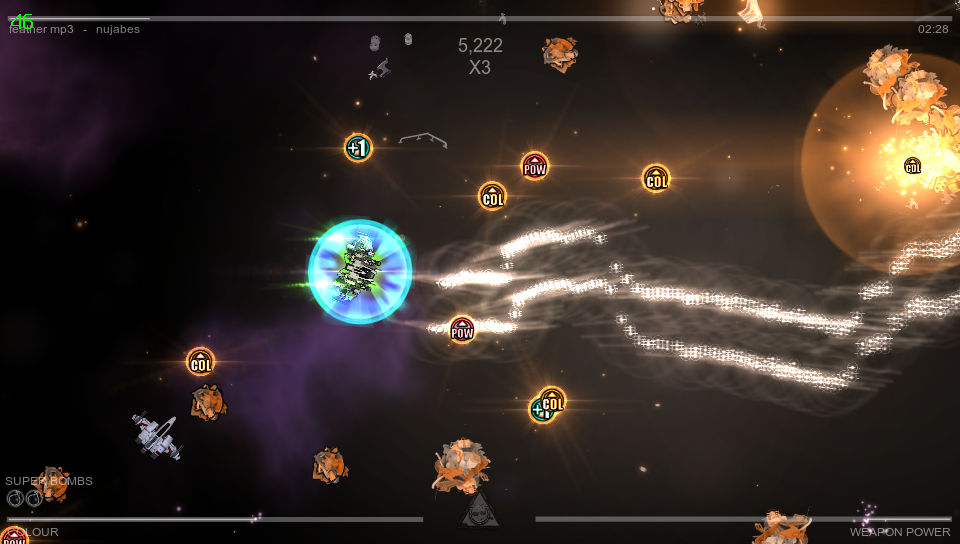
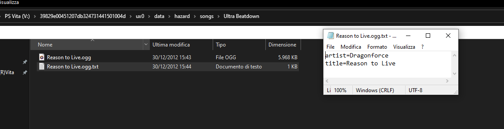

# Beat Hazard 2 Vita

<p align="center"></p>

This is a wrapper/port of <b>Beat Hazard 2</b> for the *PS Vita*.

The port works by loading the official Android ARMv7 executable in memory, resolving its imports with native functions and patching it in order to properly run.
By doing so, it's basically as if we emulate a minimalist Android environment in which we run natively the executable as it is.

## Known Issues

- Everytime the game loads a (non custom) song for the first time, game will seem like it's stuck for a few minutes. That's cause transpilation from MPEG to Vorbis codec is performed in real-time.

## Changelog

### v1.0

- Initial Release.

## Setup Instructions (For End Users)

- Install [kubridge](https://github.com/TheOfficialFloW/kubridge/releases/) and [FdFix](https://github.com/TheOfficialFloW/FdFix/releases/) by copying `kubridge.skprx` and `fd_fix.skprx` to your taiHEN plugins folder (usually `ux0:tai`) and adding two entries to your `config.txt` under `*KERNEL`:
  
```
  *KERNEL
  ux0:tai/kubridge.skprx
  ux0:tai/fd_fix.skprx
```

**Note** Don't install fd_fix.skprx if you're using rePatch plugin

- **Optional**: Install [PSVshell](https://github.com/Electry/PSVshell/releases) to overclock your device to 500Mhz.
- Install `libshacccg.suprx`, if you don't have it already, by following [this guide](https://samilops2.gitbook.io/vita-troubleshooting-guide/shader-compiler/extract-libshacccg.suprx).
- Install the vpk from Release tab.
- Obtain your copy of *Beat Hazard 2* legally for Android in form of an `.apk` file.
- Open the apk with your zip explorer and extract the files `libc++_shared.so`, `libSDL2_ttf.so`, `libtags.so` and `libmain.so` from the `lib/armeabi-v7a` folder to `ux0:data/hazard`. 
- Extract the `assets` folder from inside the apk to `ux0:data/hazard`. 

## How to use custom songs

Beat Hazard 2 features support for custom songs. On the Vita port, songs in .wav and .ogg formats are supported.

Songs must be placed in `ux0:data/hazard/songs` and an additional metadata file can be added named as `filename_of_the_song.format.txt`. In this file, two parameters can be written:
```
artist=Name of the artist
title=Name of the song
```
Those will define respectively what the game will use as Artist name and Song Title. If this file is not provided, Artist will be set as `Unknown` and Song Title will be set to the name of the song file stripped from its format.

In order to categorize songs by Albums, you can create subfolders inside the `songs` folder with the name of the album in question and place inside that the songs of said album.
Here is a practical example:

In this example, the song in question will be shown in the game as:<br>
Artist: Dragonforce<br>
Title: Reason to Live<br>
Album: Ultra Beatdown

## Build Instructions (For Developers)

In order to build the loader, you'll need a [vitasdk](https://github.com/vitasdk) build fully compiled with softfp usage.  
You can find a precompiled version here: https://github.com/vitasdk/buildscripts/actions/runs/1102643776.  
Additionally, you'll need these libraries to be compiled as well with `-mfloat-abi=softfp` added to their CFLAGS:

- [SDL2_vitagl](https://github.com/Northfear/SDL/tree/vitagl)

- [libmathneon](https://github.com/Rinnegatamante/math-neon)

  - ```bash
    make install
    ```

- [vitaShaRK](https://github.com/Rinnegatamante/vitaShaRK)

  - ```bash
    make install
    ```

- [kubridge](https://github.com/TheOfficialFloW/kubridge)

  - ```bash
    mkdir build && cd build
    cmake .. && make install
    ```

- [vitaGL](https://github.com/Rinnegatamante/vitaGL)

  - ````bash
    make SOFTFP_ABI=1 NO_DEBUG=1 install
    ````

After all these requirements are met, you can compile the loader with the following commands:

```bash
mkdir build && cd build
cmake .. && make
```

## Credits

- TheFloW for the original .so loader.
- CatoTheYounger for the screenshots and for testing the homebrew.
- Northfear for the SDL2 fork with vitaGL as backend.
